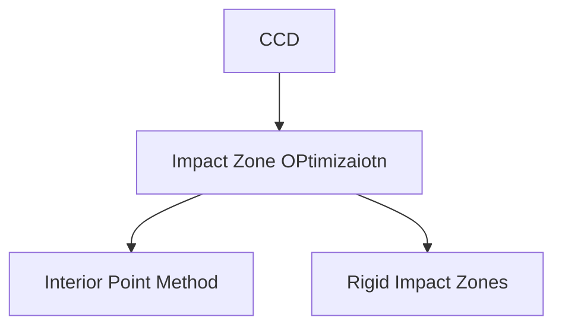

# Lecture IX - Collision Handling

## Collision Detection

- Broad-Phase Collision Culling
  - Spatial Hashing
  - BVH
- Narrow-Phase Collision Test
  - DCD
    - Edge-triangle pairs
  - CCD
    - vertex-triangle and edge-edge pairs

### Spatial Hashing

sorting to avoid empty?

Morton Code: locality

GPU Gems 3

### BVH

AABB bounding box

Reading: Energy-based Self-Collision Culling for Arbitrary Mesh Deformations.

use deformation energy

- Spatial Hashing
  - easy to implement
  - GPU friendly
  - reconpute every updating
- BVH
  - more involved
  - not GPU friendly
  - just update bounding volumes

### DCD

cannot handle tunneling.

intersection-inside

### CCD

bisection: between $[0,1]$

coplanar-inside

Issues

- Floating-point errors, especially due to root finding of a cubic equation
  - Buffering epsilons, but that causes false positives.
  - Gaming GPUs often use single floating-point precision.
- Computational costs: more expensive than DCD.
  - Some argue that broad-phase collision culling is the bottleneck.
- Difficulty in implementation.

Reading: Robust Treatment of Collisions, Contact and Friction for Cloth Animation.

## Interior Point Methods and Impact Zone Optimization

- Interior Point Methods
  - pros
    - always succeed
  - cons
    - Slow
      - far from solution
      - all of the vertices
      - cautiously by small step size
- Impact Zone Optimization
  - pros
    - Fast
      - close to solution
      - only vertices in collision
      - can take large step size
  - cons
    - may not succeed

skipped???

Rigid Impact Zones

The rigid impact zone method simply freezes vertices in collision from moving in their pre-collision state.

## Untangling Cloth

### Intersection Elimation

- without using any collision history
- don't requires intersection free

SDF

two cloth: segment cloth

minimize intersection curve

Reading: Resolving Surface Collisions through Intersection Contour Minimization.
